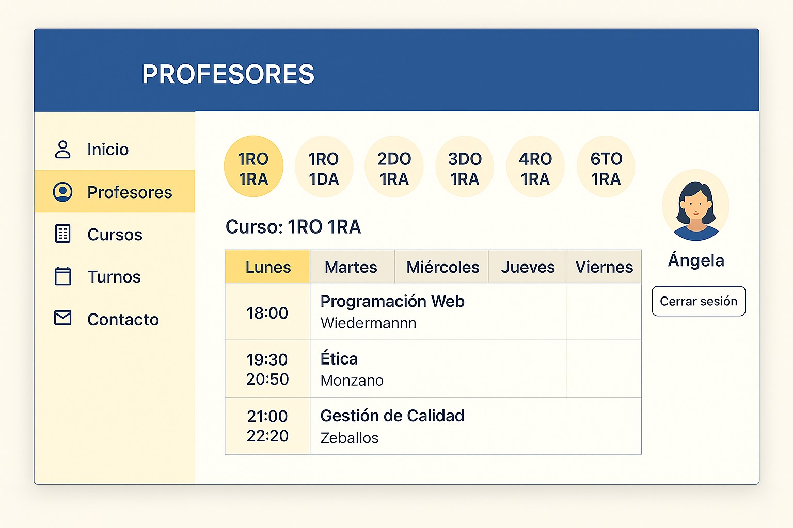
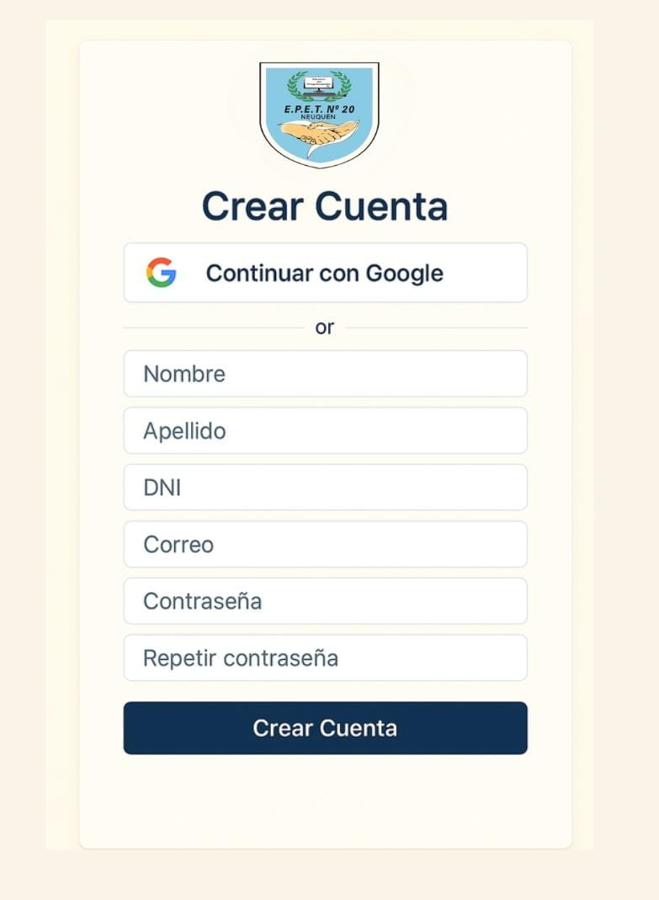
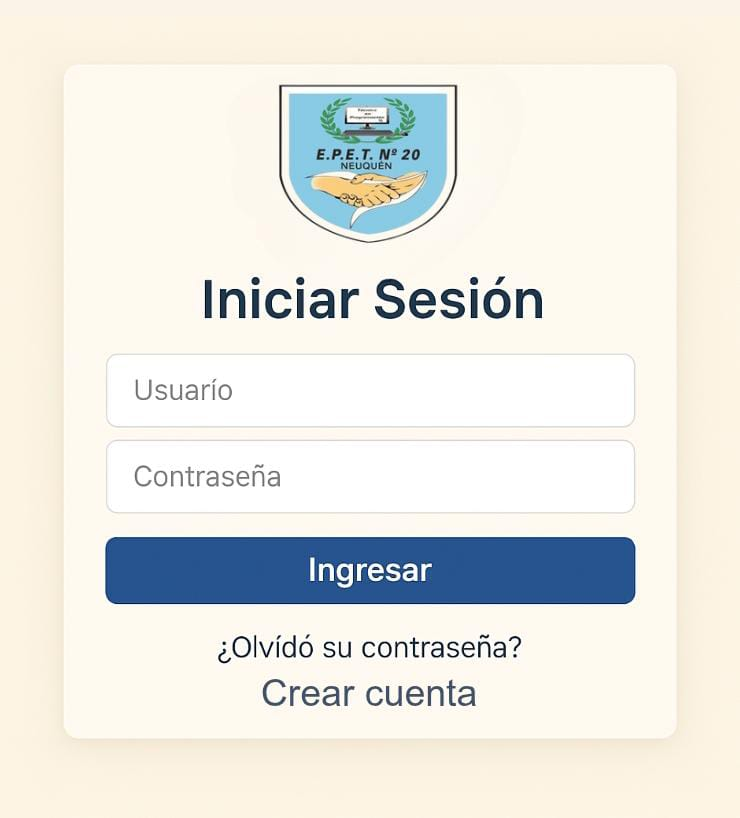
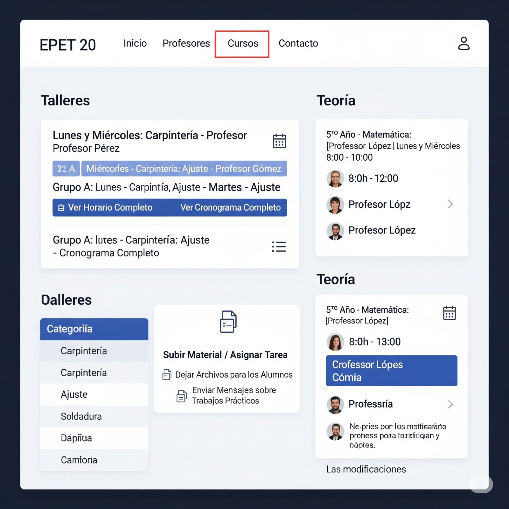
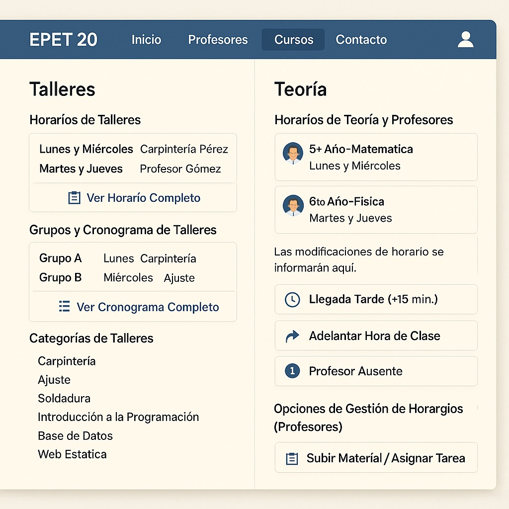

# Horario de Profesores EPET 20

 Grupo: 
Integrantes: 
 	Angela del Rosario Cáceres Turón.
 	Antonella Blasco Hugo. 
 	Valentina Nazarena Rodriguez. 
 	Josué Rojas Espinoza. 
 	Martin Nahuel Barrientos. 
 	Joaquín Parra. 

 Nombre de la app:
Horario de Profesores EPET 20

 Objetivo:
Facilitar la visualización rápida y clara del horario docente dentro de la institución.

 Herramientas utilizadas:
- Figma (diseño de pantallas)
- Canva (prototipo visual)
- ChatGPT (asistencia conceptual)
  
  Pantallas:
  ### Pantalla Principal

### Pantalla del Profesor
 

### Pantalla crear cuenta
 

### Pantalla inibio sesión
 

### Pantalla cursos 1
 

### Pantalla cursos 

### Pantalla cursos 3
 

### Pantalla de Presentismo
 

### Pantalla de Turno M
 

### Pantalla de Turno T
 

### Pantalla de Turno V
 

### Pantalla de Turno P

  
📎 [Descargar diseño en Word, ahi estan los bocetos](Diseño_Horario_Profesores_EPET20.docx) 

 Descripción de pantallas:

- **Login:** permite al usuario ingresar con correo y contraseña.
- **Pantalla principal:** muestra los horarios por turno y día.
- **Detalle de profesor:** visualiza materias asignadas a cada docente.
- **Registro (opcional):** pantalla para crear una cuenta.
